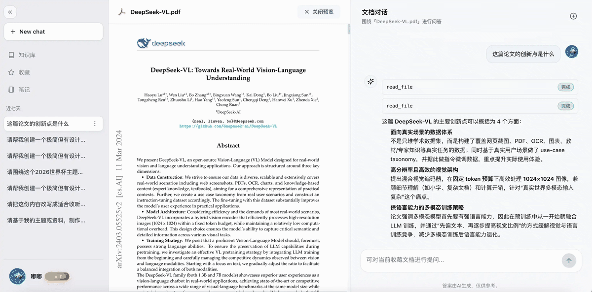

# Lumen

<div align="center">

### 面向文档理解、知识检索与 Agent 工作流的一体化开源 AI 工作空间

把知识库、长上下文对话、文档解析、笔记沉淀与运行时编排放进同一个可部署系统里。  
它不是一个只会“聊天”的 Demo，而是一个为真实产品形态、真实团队协作和真实运行环境设计的 AI Workspace。

[English](./README.en.md) · [在线体验](https://ireader.online/) · [后端说明](./backend/README.md) · [仓库结构](./docs/repository-structure.md)

<p>
  
  
  
  
  
</p>

<p>
  
</p>

</div>

## 为什么是 Lumen

很多 AI 项目只覆盖工作流中的一个局部：

- 有聊天，但没有知识沉淀
- 有文档管理，但没有执行能力
- 有 RAG 演示，但没有组织协作和运行体系

Lumen 关注的是完整工作空间，而不是单个功能点。它希望把“知识进入系统、被理解、被检索、被调用、被沉淀、被团队复用”这条链路真正串起来。

## 核心能力

| 能力 | 说明 |
| --- | --- |
| Contextual Chat | 围绕知识库、文档和业务上下文发起对话，而不是孤立聊天 |
| RAG Pipeline | 支持导入、解析、切块、索引、检索与回答的完整链路 |
| Agent Runtime | 通过 Gateway + LangGraph 承载工具调用、任务执行和工作流编排 |
| Knowledge Operations | 支持个人、组织、公开知识库，以及共享、订阅、迁移等运营动作 |
| Notes & Memory | 将对话结果沉淀为长期知识资产，支持回顾、收藏和组织复用 |
| Team & Admin | 提供组织协作、成员管理、激活码与后台运营能力 |

## 你会在这里看到什么

### 1. 一个像产品而不是像实验页的前端

Lumen 的前端不是把模型接口包一层 UI，而是按真实产品域拆分。聊天、知识库、笔记、组织、管理后台都有明确的功能边界和交互承担。

### 2. 一个按业务域组织的后端

后端以 FastAPI 为核心，围绕 `auth`、`chat`、`knowledge`、`notes`、`favorites`、`organization`、`admin`、`model_config` 等模块收口，便于持续演进。

### 3. 一条完整的文档理解与检索链路

项目支持多种文档格式导入，完成解析、切块、索引、检索、预览与问答闭环，并为后续质量治理和运营扩展留好了空间。

### 4. 一个真正可接任务的 Runtime 层

Lumen 并不把 Agent 当作一个展示按钮，而是把 Gateway 与 LangGraph 放进运行时层，承接更复杂的工具执行、状态流转和工作流组织。

## 系统总览

```text
┌───────────────────────────────────────────────────────────────┐
│                           Frontend                            │
│          React + Vite app with feature-oriented UI           │
└──────────────────────────────┬────────────────────────────────┘
                               │
                               ▼
┌───────────────────────────────────────────────────────────────┐
│                            Backend                            │
│   FastAPI domain modules: auth, chat, knowledge, notes,      │
│   favorites, organization, admin, model_config               │
└───────────────┬──────────────────────────────┬────────────────┘
                │                              │
                ▼                              ▼
┌────────────────────────────┐   ┌──────────────────────────────┐
│        RAG Services        │   │        Runtime Layer          │
│  parsing, chunking, ES,    │   │  Gateway + LangGraph +       │
│  retrieval, indexing       │   │  agent workflows             │
└───────────────┬────────────┘   └──────────────┬───────────────┘
                │                               │
                └──────────────┬────────────────┘
                               ▼
┌───────────────────────────────────────────────────────────────┐
│                   Shared Infra and Storage                    │
│      PostgreSQL · Redis · Elasticsearch · MinIO · Nginx      │
└───────────────────────────────────────────────────────────────┘
```

## 仓库结构

```text
frontend/                React + Vite Web 应用
backend/                 FastAPI 业务后端
services/rag/            文档解析、切块、检索、索引服务
runtimes/                Runtime 运行目录与辅助能力
docker/                  本地部署入口（Compose / Nginx / init-db）
shared/                  跨部署共享配置与基础库
docs/                    架构说明、迁移文档与设计资料
```

详细说明见 [仓库结构与职责边界](./docs/repository-structure.md)。

## 快速开始

### 环境要求

- Docker 与 Docker Compose
- Node.js 20+
- Python 3.12+

### 1. 克隆仓库

```bash
git clone git@github.com:changqingla/Lumen.git
cd Lumen
```

### 2. 配置环境变量

```bash
cp backend/.env.template backend/.env
./docker/init-env.sh
cp runtimes/config/.env.example runtimes/config/.env
cp runtimes/config/config.example.yaml runtimes/config/config.yaml
```

补全 `backend/.env`、`docker/.env`、`runtimes/config/.env` 和
`runtimes/config/config.yaml` 中的模型与部署参数。`init-env.sh` 使用 Compose 自己的
dotenv 语义创建或升级 `docker/.env`，补齐内部服务 token 与不符合当前部署约束的
Redis 凭据；已有 PostgreSQL/MinIO 凭据不会被自动轮换，生成值也不会在终端回显。
不要提交这些本地配置文件。

### 3. 构建前端

```bash
npm install
npm run build
```

### 4. 启动服务

```bash
docker build -f docker/backend-paper-translation.Dockerfile -t lumen-backend:paper-translation .
docker compose --env-file docker/.env -f docker/docker-compose.yml up -d
```

### 5. 访问地址

- Web（默认）: `https://<docker/.env 中的 LUMEN_SERVER_NAME>`
- Web（配置证书且显式设置 `LUMEN_HTTP_MODE=serve` 时也提供）: `http://localhost`
- Backend API: `http://localhost:13000`
- API Docs: `http://localhost:13000/api/docs`

Nginx 默认在 80 端口仅提供 ACME challenge，并将其他请求用 `308` 重定向到 HTTPS。
`serve` 模式仍会加载 443 证书；完全无证书的本地前端开发请使用 `npm run web:dev`。
Gateway、LangGraph 和 Backend 排障端口默认只绑定 `127.0.0.1`，浏览器运行请求统一
经过业务后端的会话级授权代理。完整的 TLS 与本地 HTTP 模式说明见
[Docker 启动说明](./docker/README.md)。

## 开发命令

### Frontend

```bash
npm install
npm run web:dev
npm run web:check
npm run web:test
npm run web:build
```

### Backend

```bash
cd backend
python3 -m venv .venv
source .venv/bin/activate
pip install -r requirements.txt
# 如需运行测试、格式化或类型检查，再安装开发依赖：
# pip install -r requirements-dev.txt
python run_migrations.py
uvicorn app.main:app --host 0.0.0.0 --port 13000
```

## 适合什么场景

- 想做真正能落地的知识库产品，而不是一次性问答页面
- 想把文档理解、检索和 Agent 工作流放到同一套系统中
- 想基于清晰的工程结构继续扩展团队协作和平台能力

## 致谢

Lumen 的设计与演进过程中，受到以下开源项目的启发与帮助：

- [google-gemini/gemini-cli](https://github.com/google-gemini/gemini-cli)
- [bytedance/deer-flow](https://github.com/bytedance/deer-flow)
- [infiniflow/ragflow](https://github.com/infiniflow/ragflow)

感谢这些优秀项目和背后的开源贡献者。

## 开源协议

本项目采用 Apache License 2.0 开源协议。详见 [LICENSE](./LICENSE)。

## 联系方式

- 体验地址: [https://ireader.online/](https://ireader.online/)
- 邮箱: `ht20201031@163.com`
