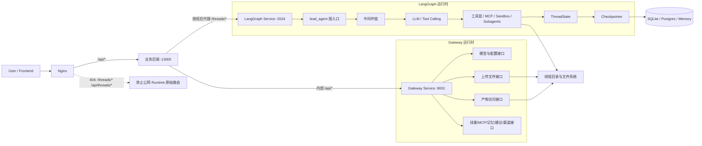
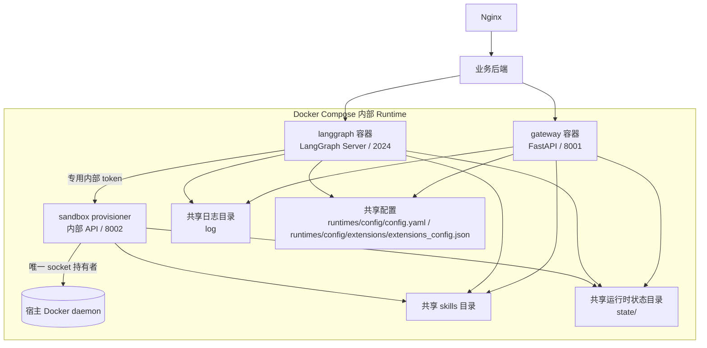
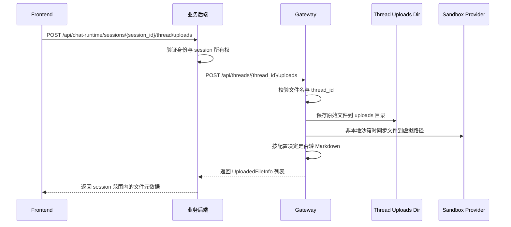
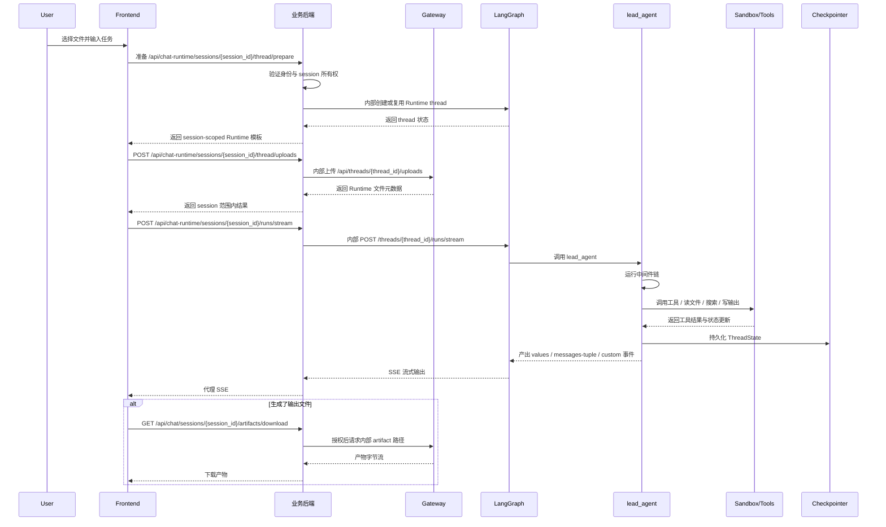
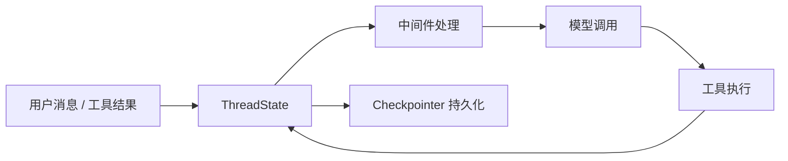

# lumen Gateway 与 LangGraph 架构技术文档

## 1. 文档目标

这份文档专门解释 lumen Runtime 中最容易混淆的两个内部服务：

- `Gateway`
- `LangGraph`

很多人在第一次看这个项目时，会把它们理解成“浏览器可以直接访问的两个后端”，但当前部署并非如此。公网请求先进入业务后端，由业务后端验证用户或游客身份、会话所有权，再调用两个 Runtime 服务：

- `Gateway` 是 Runtime 内部的配置管理与线程资源访问层。
- `LangGraph` 是主智能体运行时、线程状态承载层和流式执行层。
- `backend/` 业务后端是面向浏览器的授权与代理边界。

本文重点回答以下问题：

- 为什么项目要把 `Gateway` 和 `LangGraph` 拆成两个服务。
- 两者分别负责什么，业务后端如何安全地调用它们。
- 一次用户任务从发起到完成，内部到底经历了哪些处理阶段。
- 文件上传、线程状态、流式输出、产物下载分别在哪一层实现。
- 这套架构为什么适合 Agent 系统，而不是做成一个单体 FastAPI 服务。

---

## 2. 核心结论

先给出结论。

lumen 的 Agent 链路是三层协作架构：

- `LangGraph` 负责“让 Agent 运行起来”
- `Gateway` 负责 Runtime 的配置与文件资源能力
- 业务后端负责身份、会话所有权与公网 API

如果一定要用一句话概括，可以这样描述：

> LangGraph 是智能体执行内核，Gateway 是 Runtime 控制与资源层，业务后端是唯一面向浏览器的授权边界。

再展开一点：

- `LangGraph` 这一侧更靠近“执行引擎”。
  它负责线程、run、checkpoint、状态快照、流式事件、Agent loop 和中间件链。
- `Gateway` 这一侧更靠近 Runtime 的“控制面和资源面”。
  它负责模型列表、MCP 配置、技能管理、记忆访问、上传文件、产物下载、建议问题、渠道接入等外围能力。

因此，这两个服务不是重复建设，而是刻意分层。

---

## 3. 总体架构图

### 3.1 服务级架构图



这个图传达了三个关键点：

- 前端只通过 Nginx 访问业务后端，不持有可用于访问任意 Runtime thread 的权限。
- Agent 执行、线程状态和流式输出都在 `LangGraph` 内部完成。
- Runtime 文件与资源由 `Gateway` 处理，但对最终用户的访问仍由业务后端按 session 授权并代理。

### 3.2 部署关系图

从开发环境的 `docker/docker-compose.yml` 可以看出，项目默认把控制面拆成三个独立容器运行：

- `gateway` 监听 `8001`
- `langgraph` 监听 `2024`
- `sandbox provisioner` 监听 Compose 内网 `8002`，不发布宿主端口

部署关系如下：



Gateway 与 LangGraph 使用同一套配置、技能目录和线程数据目录，因此能协同工作。
LangGraph 不直接持有 Docker socket，而是通过带独立 token 的最小 provisioner 请求
创建、发现和销毁沙箱；调用方不能提交镜像、命令、挂载或 privileged 选项。
Provisioner 不发布宿主端口，其他 Runtime 端口默认只绑定本机地址；公网 Nginx 只把
`/api/*` 转发给业务后端，并显式拒绝 `/threads/*` 与 `/api/threads/*`。

---

## 4. 为什么要拆成 Gateway 和 LangGraph 两部分

## 4.1 LangGraph 更像执行引擎

`runtimes/backend/langgraph.json` 明确声明了两件事：

- 主图入口：`lead_agent -> src.agents:make_lead_agent`
- 状态持久化入口：`checkpointer -> src/agents/checkpointer/async_provider.py:make_checkpointer`

这意味着 LangGraph 服务关心的是：

- 图入口是什么
- Agent 是如何构造出来的
- 每个线程的状态如何持久化
- 每次执行如何产出流式事件

这些职责天然偏“运行时内核”，不适合和一堆普通业务 REST 接口揉在一起。

## 4.2 Gateway 是 Runtime 控制与资源层

`runtimes/backend/src/gateway/app.py` 中注册的路由非常能说明问题。Gateway 主要暴露的是：

- `/api/models`
- `/api/mcp/*`
- `/api/memory/*`
- `/api/skills/*`
- `/api/threads/{thread_id}/uploads/*`
- `/api/threads/{thread_id}/artifacts/*`
- `/api/agents/*`
- `/api/threads/{thread_id}/suggestions`
- `/api/channels/*`

可以看到，Gateway 承担的是“围绕 Agent 的 Runtime 配置与资源能力”，而不是 Agent 主循环本身。这些路由是内部 API，其中的 `thread_id` 不能由公网客户端任意指定。生产应用在 ASGI 边界为所有 `/api` 路径强制校验 `X-Gateway-Internal-Token`，并使用恒定时间比较；只有 `GET /health` 保持匿名以支持容器健康检查。缺少 `GATEWAY_INTERNAL_API_TOKEN` 时 Gateway 启动失败，不能通过空配置关闭认证。

## 4.3 这种拆分的工程收益

拆分后有几个明显收益：

### 第一，职责边界更清晰

- 用户与 session 授权问题看业务后端
- Agent 执行问题看 `LangGraph`
- Runtime 文件、配置、下载与管理问题看 `Gateway`

### 第二，更利于独立演进

例如：

- 以后可以替换 Gateway 的接口风格，而不影响 Agent loop。
- 也可以升级 LangGraph 图和中间件链，而不破坏外部 API 结构。

### 第三，更符合 Agent 系统的真实结构

现代 Agent 产品通常至少有两层：

- 执行层
- 产品接口层

lumen 只是把这件事显式实现出来了。

---

## 5. Gateway 的职责与内部结构

## 5.1 Gateway 的定位

Gateway 是一个基于 FastAPI 的 Runtime 内部服务。它不是 LangGraph 的简单转发代理，而是承担了以下角色：

- 配置读取与内部管理
- 线程资源路径校验
- 文件上传与文件下载
- 技能、MCP、记忆、模型等平台能力的 REST 化
- 渠道服务生命周期管理

换句话说，Gateway 是“Runtime 控制面 + 资源访问面”。最终用户的租户与 session 授权仍属于业务后端。

## 5.2 Gateway 启动流程

Gateway 的入口在 `runtimes/backend/src/gateway/run.py`，核心应用在 `runtimes/backend/src/gateway/app.py`。

它的启动过程可以概括为：

1. 创建 FastAPI 应用。
2. 在 `lifespan` 阶段加载主配置并做启动校验。
3. 读取 Gateway 监听配置。
4. 尝试启动 IM channel service。
5. 注册全部业务路由。

这里有一个很重要的设计点：

> Gateway 不在启动时初始化 MCP 工具。

原因是：

- Gateway 本身不直接执行 Agent 工具调用。
- 工具初始化由 LangGraph 侧在真正运行 Agent 时按需完成。

这说明项目明确区分了：

- Gateway 管理配置
- LangGraph 消费配置

MCP 与 Skill 启用状态的默认运行态文件是 `runtimes/config/extensions/extensions_config.json`；该文件由 Git 忽略，仓库只提供同目录的 `extensions_config.example.json`。Gateway 对运行态配置做原子写入，LangGraph 以只读方式读取同一份文件，并在文件创建、替换或删除后使缓存失效，于后续工具加载时刷新。

## 5.3 Gateway 路由分组

可以把 Gateway 路由分成四类。

### A. 平台配置类接口

- 模型列表与模型详情
- MCP 配置
- 技能列表与技能安装
- 自定义 Agent 配置
- 记忆查看与重载

这一类接口的特点是：

- 面向内部管理流程或受限运维环境
- 不直接参与一次 run 的主执行链

### B. 文件资源类接口

- 上传文件
- 列出上传文件
- 删除上传文件
- 下载产物文件

这一类接口直接连接线程目录和文件系统，为业务后端的会话级文件 API 提供内部能力。

### C. 辅助交互类接口

- 追问建议
- 渠道管理

这类接口不直接替代 Agent 主对话，但会增强整体产品体验。

### D. 健康与状态类接口

- `/health`

用于服务可用性检查和部署探活。

## 5.4 Gateway 处理文件上传的工作原理

文件上传是理解 Gateway 价值的最佳例子。

上传流程大致如下：



这条链路里有几个关键点：

- 上传文件不是随便放到公共目录，而是严格绑定到 `thread_id`。
- Gateway 会把文件写入线程专属目录。
- 如果使用非本地沙箱，Gateway 还会把文件同步到沙箱可见路径。
- 某些格式会自动转换成 Markdown，便于后续 Agent 阅读。

因此，Gateway 不只是上传网关，它实际上负责把“用户文件”转成“Agent 可用文件上下文”。

## 5.5 Gateway 处理产物访问的工作原理

产物访问接口也体现了它的资源访问层定位。

Gateway 内部的 `/api/threads/{thread_id}/artifacts/{path}` 负责：

- 将虚拟路径解析为线程内真实路径
- 阻止路径穿越
- 根据文件类型决定返回方式
- 支持内联预览或强制下载
- 对 `.skill` 压缩包支持读取内部文件

换句话说，Gateway 在这里承担的是一个“线程内文件资源控制器”的角色，而不是单纯静态文件服务器。公网下载使用业务后端 `/api/chat/sessions/{session_id}/artifacts/download`，后端验证会话与产物路径后才向 Gateway 取回内容。

---

## 6. LangGraph 的职责与内部结构

## 6.1 LangGraph 的定位

LangGraph 在 lumen 中不是“可选集成”，而是主智能体运行时的承载层。

它负责的核心能力包括：

- 图入口暴露
- 线程与 run 生命周期管理
- 状态持久化接入 checkpointer
- 流式事件输出
- 调用主智能体工厂 `make_lead_agent()`

所以它更接近下面这个角色：

> Agent Runtime Host

## 6.2 LangGraph 图入口

Runtime 内部只暴露一个主图入口：

- `lead_agent`

它绑定到：

- `src.agents:make_lead_agent`

这说明整个系统运行时并不是“多个一等主图之间切换”，而是：

- 一个主图入口
- 一个主 orchestrator agent
- 外加中间件、工具和子代理扩展

## 6.3 主智能体是如何构建出来的

`runtimes/backend/src/agents/lead_agent/agent.py` 中的 `make_lead_agent(config)` 是主图装配工厂。

它会在运行时完成以下工作：

1. 读取 `RunnableConfig` 中的运行参数。
2. 解析最终模型名。
3. 判断是否启用 thinking、plan mode、subagent、bootstrap。
4. 组装工具列表。
5. 组装中间件链。
6. 组装系统提示词。
7. 使用 `ThreadState` 作为统一状态模式。
8. 最终调用 `create_agent()` 返回实际运行的 Agent graph。

这意味着：

- LangGraph 负责承载 graph
- `create_agent()` 负责底层 tool-calling loop
- 项目代码负责把这套 loop 改造成完整的产品级 Agent

## 6.4 LangGraph 内部执行架构图

```mermaid
flowchart TD
    ENTRY[LangGraph 请求入口\n/threads /runs /runs/stream]
    ENTRY --> FACTORY[make_lead_agent(config)]
    FACTORY --> AGENT[create_agent(...)]
    AGENT --> STATE[ThreadState]
    AGENT --> MW[中间件链]
    MW --> MODEL[模型调用]
    MODEL -->|tool_calls| TOOLS[工具执行]
    TOOLS -->|Command(update=...) / ToolMessage| STATE
    STATE --> MODEL
    STATE --> CKPT[Checkpointer 持久化]
```

这个图很重要，因为它揭示了一个事实：

lumen 的核心不是“很多手写 graph node 的节点图”，而是“标准 Agent loop + 自定义状态与中间件增强”。

## 6.5 ThreadState 是这套架构的状态骨架

LangGraph 这一侧并不是只保存一个消息数组，而是运行在 `ThreadState` 上。

当前线程状态包含但不限于：

- `messages`
- `sandbox`
- `thread_data`
- `title`
- `artifacts`
- `todos`
- `uploaded_files`
- `viewed_images`

这意味着每次 run 不只是追加消息，而是在读写一份完整线程状态。

尤其重要的是：

- `artifacts` 有 reducer，会做合并去重
- `viewed_images` 也有 reducer，会做合并或清空

所以它不是“请求级状态”，而是“线程级运行态”。

## 6.6 中间件链为什么是 LangGraph 架构的核心

在 lumen 中，中间件链不是辅助逻辑，而是主执行架构的一部分。

主中间件链大致是：

1. `ThreadDataMiddleware`
2. `UploadsMiddleware`
3. `SandboxMiddleware`
4. `DanglingToolCallMiddleware`
5. `SummarizationMiddleware`（可选）
6. `TodoMiddleware`（计划模式可选）
7. `TitleMiddleware`
8. `MemoryMiddleware`
9. `ViewImageMiddleware`（视觉模型可选）
10. `SubagentLimitMiddleware`（子代理开启时可选）
11. `ClarificationMiddleware`

它们的作用不是“装饰请求”，而是实实在在改变 Agent 运行语义。

例如：

- `ThreadDataMiddleware` 把线程目录信息放进状态。
- `UploadsMiddleware` 把上传文件前置到用户消息上下文中。
- `SandboxMiddleware` 让工具能在独立沙箱里执行。
- `SummarizationMiddleware` 在长上下文时压缩消息窗口。
- `ClarificationMiddleware` 可以通过 `goto=END` 直接中断本轮执行。

从架构角度说，lumen 的“图编排”有很大一部分不是写在 node/edge 上，而是写在 middleware ordering 上。

---

## 7. Gateway 与 LangGraph 的接口边界

## 7.1 谁负责什么请求

当前边界要区分“公网产品 API”和“Runtime 内部 API”。

### 浏览器访问业务后端

- `POST /api/chat-runtime/sessions/{session_id}/thread/prepare`
- `POST /api/chat-runtime/sessions/{session_id}/thread/uploads`
- `DELETE /api/chat-runtime/sessions/{session_id}/thread/uploads/{filename}`
- `POST /api/chat-runtime/sessions/{session_id}/runs/stream`
- `GET /api/chat-runtime/sessions/{session_id}/runs?status=running|pending`
- `GET /api/chat-runtime/sessions/{session_id}/runs/{run_id}/stream`
- `POST /api/chat-runtime/sessions/{session_id}/runs/{run_id}/cancel`
- `GET /api/chat/sessions/{session_id}/artifacts/download?object_path=...`

这类接口的共同点是：

- 使用已鉴权用户或服务端签发的游客身份
- 先根据 `session_id` 查询当前身份拥有的会话
- 由服务端从 session 配置推导 `thread_id`、模型与运行上下文
- 代理 Runtime 响应或 SSE，不让浏览器绕过所有权校验

### 业务后端调用 Runtime 内部接口

- LangGraph：`/threads/{thread_id}/runs/*` 等线程与 run 协议
- `GET /api/threads/{thread_id}/uploads/list`
- `POST /api/threads/{thread_id}/uploads`
- `DELETE /api/threads/{thread_id}/uploads/{filename}`
- `GET /api/threads/{thread_id}/artifacts/{path}`
- Gateway 其他配置与管理 `/api/*`

这些路由的技术说明仍然有价值，但它们是服务间协议，不是浏览器 API。Nginx 对 `/threads/*` 和 `/api/threads/*` 直接返回 `404`；Gateway 和 LangGraph 宿主机端口默认只绑定本机地址。

## 7.2 为什么必须由业务后端代理

LangGraph 的原始路由以 `thread_id` 为边界，Runtime Gateway 的文件路由也直接接受 `thread_id`。但对产品系统而言，浏览器提交的 thread 声明不能作为所有权证据。

业务后端以当前身份和 `session_id` 查库，然后从已授权的 session 推导 Runtime thread。这个边界同时保护流式启动、run 列表、断线 join、cancel、上传与产物下载，避免通过猜测或替换 `thread_id` 跨会话访问。

---

## 8. 一次完整任务的处理流程

下面用一个最典型的场景说明：

> 用户上传文件，然后发起一条需要 Agent 分析文件并生成报告的请求。

## 8.1 总体时序图



## 8.2 详细处理步骤

### 第一步，业务后端准备线程

前端提交业务 `session_id`，业务后端校验当前身份拥有该 session，再创建或复用服务端推导的 Runtime thread。

如果 session 选择了知识库，业务后端还会重新验证 KB 可见性和文档状态，以最多 20 篇一批读取 Markdown。物化 manifest 绑定 `kb_id + doc_id + document revision + SHA-256 + size + Runtime filename`；任一批次读取失败或 revision 变化都会中止，旧 manifest 和旧文件不会被当作缩减后的成功结果清理。

线程 ID 后续会被用于：

- LangGraph 状态持久化
- 上传目录隔离
- 工作目录隔离
- 输出目录隔离

### 第二步，上传文件经业务后端进入 Gateway

前端上传到 session-scoped 业务 API，业务后端校验 session 后再调用 Gateway，而不是让浏览器直接指定 Runtime `thread_id`。

这是因为上传本质上是资源管理问题，需要：

- 文件名安全校验
- 落盘
- 虚拟路径映射
- 沙箱同步
- Markdown 转换

这些文件操作由 Gateway 处理，所有权判定则由业务后端处理。

### 第三步，执行请求经业务后端进入 LangGraph

文件准备好后，前端调用 `/api/chat-runtime/sessions/{session_id}/runs/stream`。业务后端重建受信的模型、thread 和运行上下文，再向 LangGraph 的内部 `runs/stream` 接口启动执行。

在模型解析和额度预留之前，业务后端会再次比较当前 session scope、KB 权限、已提交 Markdown 的文档集合与物化 manifest，并通过 Gateway 内部 metadata 接口流式核对受管文件的实际字节数和 SHA-256。这条 Runtime 文件链路不依赖分块、embedding 或 Elasticsearch 状态；缺少 prepare、权限撤销、Markdown revision 变化、文件删除或同大小内容篡改都会拒绝 Run。客户端传入的 `kb_id/doc_ids` 不参与授权，最终上下文只由服务端验证结果生成。

此时：

- `thread_id` 进入 LangGraph 运行上下文
- `make_lead_agent()` 构造 Agent
- 中间件链开始工作

### 第四步，中间件补齐执行上下文

这一阶段最关键的两个中间件是：

- `ThreadDataMiddleware`
- `UploadsMiddleware`

它们会把线程目录和上传文件信息注入到状态/消息中，让模型知道自己当前可访问哪些文件、工作目录和输出目录在哪里。

### 第五步，模型进入 tool-calling loop

Agent 调模型后会出现两种情况：

- 直接回答
- 发起工具调用

如果发起工具调用，LangGraph 会继续：

1. 执行工具
2. 将 ToolMessage 或状态更新写回状态
3. 再次进入模型

直到本轮结束。

### 第六步，输出结果与产物

本轮执行结束后，结果有两种主要形式：

- 文本消息
- 文件产物

文本消息由 LangGraph 产生 SSE，再经业务后端原样代理给前端。
文件产物记录在 `artifacts` 状态中，Gateway 负责内部读取，业务后端验证 session 与产物路径后对外提供下载。

---

## 9. 状态流、文件流与事件流

## 9.1 状态流

状态流主要发生在 LangGraph 内部：



这里的重点是：

- 状态不是只在内存里存在
- 每轮 run 都可以恢复上一次线程状态

## 9.2 文件流

文件流跨越 Gateway、LangGraph 和沙箱三层：

```mermaid
flowchart LR
    UF[用户本地文件] --> API[业务后端 session 上传接口]
    API --> GW[Gateway 内部上传接口]
    GW --> UP[threads/{thread_id}/user-data/uploads]
    UP --> SBX[Sandbox 虚拟路径\n/mnt/user-data/uploads]
    SBX --> AG[Agent 工具读取]
    AG --> OUT[生成 outputs 文件]
    OUT --> ARTS[artifacts 状态]
    ARTS --> GWDL[Gateway 内部产物读取]
    GWDL --> APIDL[业务后端授权下载]
```

这说明：

- 公网文件写入入口在业务后端，Gateway 是内部落盘与转换层
- 文件消费入口在 LangGraph/Agent
- 文件对外读取由业务后端授权，再向 Gateway 取回

## 9.3 事件流

事件流由 LangGraph 产生，通过业务后端代理到前端：

- `values`
  返回阶段性完整状态快照，例如 `messages`、`title`、`artifacts`
- `messages-tuple`
  返回单条消息增量，例如 AI 文本、工具调用、工具结果
- `custom`
  返回额外状态文本，例如运行状态提示
- `end`
  表示本轮流式输出结束

因此，前端看到的“流式 Agent 输出”，本质上是经会话授权代理的 LangGraph 流式事件协议。

---

## 10. Checkpointer 在这套架构中的作用

## 10.1 为什么它属于 LangGraph 层

Checkpointer 解决的是线程状态的持久化问题，所以它天然属于 LangGraph 运行时，而不是 Gateway。

它持久化的不是单纯聊天文本，而是完整线程状态，包括：

- 消息历史
- 结构化状态字段
- 标题
- 产物列表
- todo
- 图片上下文

## 10.2 为什么这对 Gateway 也重要

虽然 Checkpointer 属于 LangGraph，但 Gateway 依赖它的结果。

例如，产物路径来自线程状态中的 `artifacts`，断线后 join 也依赖 LangGraph 保存的 run 与线程状态。业务后端在对外返回这些结果前，仍会重新验证 session 所有权。

---

## 11. 为什么这种架构适合 Agent 系统

## 11.1 Agent 系统天然需要执行层与产品层分离

如果把 Gateway 和 LangGraph 强行揉成一个服务，通常会出现三类问题：

- 执行路径与管理路径混在一起
- 流式执行接口和普通 REST 接口互相污染
- 线程状态、文件资源、模型配置等问题纠缠在同一抽象层里

lumen 通过拆层把这些问题解耦了。

## 11.2 LangGraph、Gateway 与业务后端各自拥有边界

更抽象地看：

- `LangGraph` 解决的是“如何让一个带状态的 Agent 持续运行”
- `Gateway` 解决的是“Runtime 如何管理配置和线程文件资源”
- 业务后端解决的是“哪个身份可以对哪个 session 执行什么操作”

这种分工非常符合 Agent 平台的长期演进方向。

## 11.3 以后扩展会更自然

这种拆层让项目很容易继续演化出：

- 更多前端功能页与管理后台
- 更多外部渠道接入
- 更多文件和资源管理能力
- 更复杂的 Agent 图或多 Agent 调度

而不必推翻现有结构。

---

## 12. 常见误解澄清

## 12.1 Gateway 不是公网反向代理

公网入口是 Nginx 和业务后端，Gateway 是业务后端使用的 Runtime 内部服务。它也不是 LangGraph 的简单转发层，而是拥有自己的业务逻辑：

- 文件落盘
- 文件转换
- 产物读取
- 技能管理
- 记忆访问
- MCP 配置
- 渠道服务管理

## 12.2 LangGraph 也不是“只负责聊天回复”

它不是一个简单聊天接口，而是：

- 线程状态宿主
- Agent 执行内核
- 流式事件源
- 状态持久化消费者

## 12.3 产物并不是直接由 LangGraph 提供下载

LangGraph 负责把产物路径写入状态，Gateway 负责内部文件读取与内容协商，业务后端则负责 session 和产物路径授权并对外返回内容。

这是一种非常合理的分工：

- LangGraph 负责“生成”
- Gateway 负责“内部读取”
- 业务后端负责“授权后对外返回”

---

## 13. 架构总结

最后用一句更工程化的话总结这套设计：

> lumen 将公网业务 API 与 Agent Runtime 分离。LangGraph 负责线程化、状态化、流式化的智能体执行，Gateway 负责 Runtime 文件、配置和管理能力，业务后端负责身份、会话所有权和对外代理。原始 `/threads/*` 与 `/api/threads/*` 只是内部服务协议。

如果把这句话拆开，就是五个关键词：

- `LangGraph`：执行内核
- `Gateway`：Runtime 控制与资源层
- `backend/`：公网授权与 session 代理层
- `ThreadState + Checkpointer`：状态底座
- `线程目录 + artifacts`：文件底座

理解了这四点，就基本理解了 lumen 后端最核心的系统结构。
