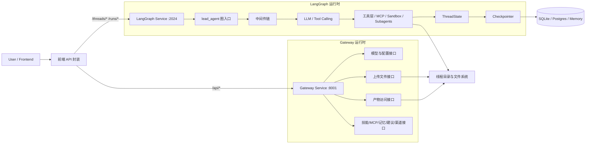
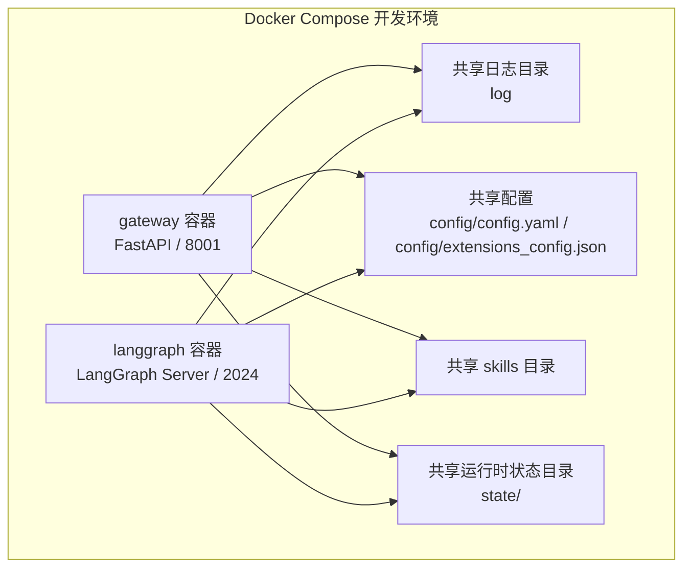
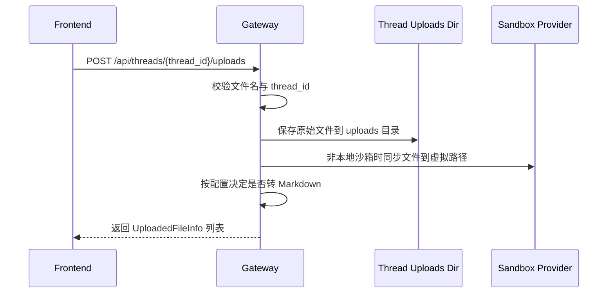
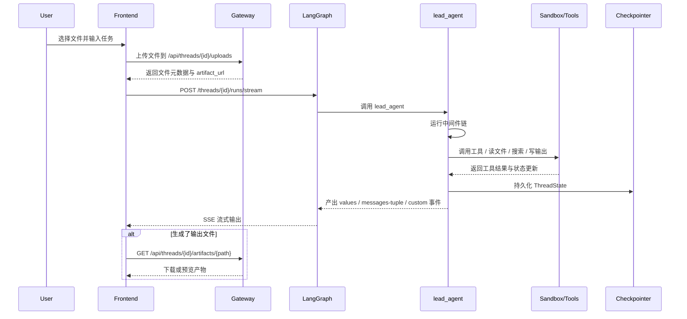
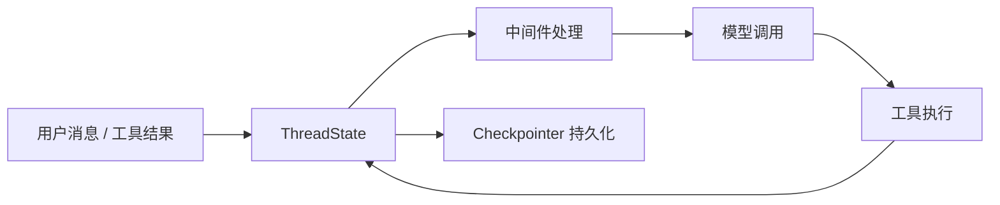

# lumen Gateway 与 LangGraph 架构技术文档

## 1. 文档目标

这份文档专门解释 lumen 中最容易混淆的两个后端部分：

- `Gateway`
- `LangGraph`

很多人在第一次看这个项目时，会把它们理解成“两个都能处理请求的后端服务”，但这只是表面现象。更准确地说，它们分别承担了两种完全不同的职责：

- `Gateway` 是面向前端与外围系统的业务接口层与资源访问层。
- `LangGraph` 是主智能体运行时、线程状态承载层和流式执行层。

本文重点回答以下问题：

- 为什么项目要把 `Gateway` 和 `LangGraph` 拆成两个服务。
- 两者分别负责什么，哪些请求应该打到哪一边。
- 一次用户任务从发起到完成，内部到底经历了哪些处理阶段。
- 文件上传、线程状态、流式输出、产物下载分别在哪一层实现。
- 这套架构为什么适合 Agent 系统，而不是做成一个单体 FastAPI 服务。

---

## 2. 核心结论

先给出结论。

lumen 的后端并不是一个单体 API 服务，而是一种“双服务协作架构”：

- `LangGraph` 负责“让 Agent 运行起来”
- `Gateway` 负责“把 Agent 系统对外暴露成可消费的产品接口”

如果一定要用一句话概括，可以这样描述：

> LangGraph 是智能体执行内核，Gateway 是智能体产品化接口层。

再展开一点：

- `LangGraph` 这一侧更靠近“执行引擎”。
  它负责线程、run、checkpoint、状态快照、流式事件、Agent loop 和中间件链。
- `Gateway` 这一侧更靠近“业务平台”。
  它负责模型列表、MCP 配置、技能管理、记忆访问、上传文件、产物下载、建议问题、渠道接入等外围能力。

因此，这两个服务不是重复建设，而是刻意分层。

---

## 3. 总体架构图

### 3.1 服务级架构图



这个图传达了三个关键点：

- 前端并不是只连一个后端，而是按接口类型分别访问 `LangGraph` 和 `Gateway`。
- Agent 执行、线程状态和流式输出都在 `LangGraph` 内部完成。
- 文件与资源的管理、访问和下载能力主要由 `Gateway` 对外统一暴露。

### 3.2 部署关系图

从开发环境的 `docker/docker-compose.yml` 可以看出，项目默认把它们作为两个独立容器运行：

- `gateway` 监听 `8001`
- `langgraph` 监听 `2024`

部署关系如下：



这说明两边虽然是独立进程，但它们使用同一套配置、同一套技能目录和同一份线程数据目录，因此能协同工作。

---

## 4. 为什么要拆成 Gateway 和 LangGraph 两部分

## 4.1 LangGraph 更像执行引擎

`backend/langgraph.json` 明确声明了两件事：

- 主图入口：`lead_agent -> src.agents:make_lead_agent`
- 状态持久化入口：`checkpointer -> src/agents/checkpointer/async_provider.py:make_checkpointer`

这意味着 LangGraph 服务关心的是：

- 图入口是什么
- Agent 是如何构造出来的
- 每个线程的状态如何持久化
- 每次执行如何产出流式事件

这些职责天然偏“运行时内核”，不适合和一堆普通业务 REST 接口揉在一起。

## 4.2 Gateway 更像产品化接口层

`backend/src/gateway/app.py` 中注册的路由非常能说明问题。Gateway 主要暴露的是：

- `/api/models`
- `/api/mcp/*`
- `/api/memory/*`
- `/api/skills/*`
- `/api/threads/{thread_id}/uploads/*`
- `/api/threads/{thread_id}/artifacts/*`
- `/api/agents/*`
- `/api/threads/{thread_id}/suggestions`
- `/api/channels/*`

可以看到，Gateway 承担的是“围绕 Agent 的外围产品能力”，而不是 Agent 主循环本身。

## 4.3 这种拆分的工程收益

拆分后有几个明显收益：

### 第一，职责边界更清晰

- Agent 执行问题看 `LangGraph`
- 文件、配置、下载、管理问题看 `Gateway`

### 第二，更利于独立演进

例如：

- 以后可以替换 Gateway 的接口风格，而不影响 Agent loop。
- 也可以升级 LangGraph 图和中间件链，而不破坏外部 API 结构。

### 第三，更符合 Agent 系统的真实结构

现代 Agent 产品通常至少有两层：

- 执行层
- 产品接口层

lumen 只是把这件事显式实现出来了。

---

## 5. Gateway 的职责与内部结构

## 5.1 Gateway 的定位

Gateway 是一个基于 FastAPI 的应用层服务。它不是“再包一层转发代理”那么简单，而是承担了以下角色：

- 配置读取与对外展示
- 资源访问控制
- 文件上传与文件下载
- 技能、MCP、记忆、模型等平台能力的 REST 化
- 渠道服务生命周期管理

换句话说，Gateway 是“Agent 平台控制面 + 资源访问面”。

## 5.2 Gateway 启动流程

Gateway 的入口在 `backend/src/gateway/run.py`，核心应用在 `backend/src/gateway/app.py`。

它的启动过程可以概括为：

1. 创建 FastAPI 应用。
2. 在 `lifespan` 阶段加载主配置并做启动校验。
3. 读取 Gateway 监听配置。
4. 尝试启动 IM channel service。
5. 注册全部业务路由。

这里有一个很重要的设计点：

> Gateway 不在启动时初始化 MCP 工具。

原因是：

- Gateway 本身不直接执行 Agent 工具调用。
- 工具初始化由 LangGraph 侧在真正运行 Agent 时按需完成。

这说明项目明确区分了：

- Gateway 管理配置
- LangGraph 消费配置

## 5.3 Gateway 路由分组

可以把 Gateway 路由分成四类。

### A. 平台配置类接口

- 模型列表与模型详情
- MCP 配置
- 技能列表与技能安装
- 自定义 Agent 配置
- 记忆查看与重载

这一类接口的特点是：

- 面向前端管理页或运维后台
- 不直接参与一次 run 的主执行链

### B. 文件资源类接口

- 上传文件
- 列出上传文件
- 删除上传文件
- 下载产物文件

这一类接口直接连接线程目录和文件系统，是前端文件体验的重要支撑。

### C. 辅助交互类接口

- 追问建议
- 渠道管理

这类接口不直接替代 Agent 主对话，但会增强整体产品体验。

### D. 健康与状态类接口

- `/health`

用于服务可用性检查和部署探活。

## 5.4 Gateway 处理文件上传的工作原理

文件上传是理解 Gateway 价值的最佳例子。

上传流程大致如下：



这条链路里有几个关键点：

- 上传文件不是随便放到公共目录，而是严格绑定到 `thread_id`。
- Gateway 会把文件写入线程专属目录。
- 如果使用非本地沙箱，Gateway 还会把文件同步到沙箱可见路径。
- 某些格式会自动转换成 Markdown，便于后续 Agent 阅读。

因此，Gateway 不只是上传网关，它实际上负责把“用户文件”转成“Agent 可用文件上下文”。

## 5.5 Gateway 处理产物访问的工作原理

产物访问接口也体现了它的资源访问层定位。

`/api/threads/{thread_id}/artifacts/{path}` 的职责包括：

- 将虚拟路径解析为线程内真实路径
- 阻止路径穿越
- 根据文件类型决定返回方式
- 支持内联预览或强制下载
- 对 `.skill` 压缩包支持读取内部文件

换句话说，Gateway 在这里承担的是一个“线程内文件资源控制器”的角色，而不是单纯静态文件服务器。

---

## 6. LangGraph 的职责与内部结构

## 6.1 LangGraph 的定位

LangGraph 在 lumen 中不是“可选集成”，而是主智能体运行时的承载层。

它负责的核心能力包括：

- 图入口暴露
- 线程与 run 生命周期管理
- 状态持久化接入 checkpointer
- 流式事件输出
- 调用主智能体工厂 `make_lead_agent()`

所以它更接近下面这个角色：

> Agent Runtime Host

## 6.2 LangGraph 图入口

项目对外只暴露一个主图入口：

- `lead_agent`

它绑定到：

- `src.agents:make_lead_agent`

这说明整个系统运行时并不是“多个一等主图之间切换”，而是：

- 一个主图入口
- 一个主 orchestrator agent
- 外加中间件、工具和子代理扩展

## 6.3 主智能体是如何构建出来的

`backend/src/agents/lead_agent/agent.py` 中的 `make_lead_agent(config)` 是主图装配工厂。

它会在运行时完成以下工作：

1. 读取 `RunnableConfig` 中的运行参数。
2. 解析最终模型名。
3. 判断是否启用 thinking、plan mode、subagent、bootstrap。
4. 组装工具列表。
5. 组装中间件链。
6. 组装系统提示词。
7. 使用 `ThreadState` 作为统一状态模式。
8. 最终调用 `create_agent()` 返回实际运行的 Agent graph。

这意味着：

- LangGraph 负责承载 graph
- `create_agent()` 负责底层 tool-calling loop
- 项目代码负责把这套 loop 改造成完整的产品级 Agent

## 6.4 LangGraph 内部执行架构图

```mermaid
flowchart TD
    ENTRY[LangGraph 请求入口\n/threads /runs /runs/stream]
    ENTRY --> FACTORY[make_lead_agent(config)]
    FACTORY --> AGENT[create_agent(...)]
    AGENT --> STATE[ThreadState]
    AGENT --> MW[中间件链]
    MW --> MODEL[模型调用]
    MODEL -->|tool_calls| TOOLS[工具执行]
    TOOLS -->|Command(update=...) / ToolMessage| STATE
    STATE --> MODEL
    STATE --> CKPT[Checkpointer 持久化]
```

这个图很重要，因为它揭示了一个事实：

lumen 的核心不是“很多手写 graph node 的节点图”，而是“标准 Agent loop + 自定义状态与中间件增强”。

## 6.5 ThreadState 是这套架构的状态骨架

LangGraph 这一侧并不是只保存一个消息数组，而是运行在 `ThreadState` 上。

当前线程状态包含但不限于：

- `messages`
- `sandbox`
- `thread_data`
- `title`
- `artifacts`
- `todos`
- `uploaded_files`
- `viewed_images`

这意味着每次 run 不只是追加消息，而是在读写一份完整线程状态。

尤其重要的是：

- `artifacts` 有 reducer，会做合并去重
- `viewed_images` 也有 reducer，会做合并或清空

所以它不是“请求级状态”，而是“线程级运行态”。

## 6.6 中间件链为什么是 LangGraph 架构的核心

在 lumen 中，中间件链不是辅助逻辑，而是主执行架构的一部分。

主中间件链大致是：

1. `ThreadDataMiddleware`
2. `UploadsMiddleware`
3. `SandboxMiddleware`
4. `DanglingToolCallMiddleware`
5. `SummarizationMiddleware`（可选）
6. `TodoMiddleware`（计划模式可选）
7. `TitleMiddleware`
8. `MemoryMiddleware`
9. `ViewImageMiddleware`（视觉模型可选）
10. `SubagentLimitMiddleware`（子代理开启时可选）
11. `ClarificationMiddleware`

它们的作用不是“装饰请求”，而是实实在在改变 Agent 运行语义。

例如：

- `ThreadDataMiddleware` 把线程目录信息放进状态。
- `UploadsMiddleware` 把上传文件前置到用户消息上下文中。
- `SandboxMiddleware` 让工具能在独立沙箱里执行。
- `SummarizationMiddleware` 在长上下文时压缩消息窗口。
- `ClarificationMiddleware` 可以通过 `goto=END` 直接中断本轮执行。

从架构角度说，lumen 的“图编排”有很大一部分不是写在 node/edge 上，而是写在 middleware ordering 上。

---

## 7. Gateway 与 LangGraph 的接口边界

## 7.1 谁负责什么请求

从前端 `frontend/src/shared/api/client.ts` 的调用方式可以看得很清楚，前端会同时访问两套接口：

### 打到 LangGraph 的接口

- `POST /threads`
- `GET /threads/{thread_id}/state`
- `POST /threads/{thread_id}/runs/stream`

这类接口的共同点是：

- 和线程执行直接相关
- 涉及 run、messages、artifacts、流式事件

### 打到 Gateway 的接口

- `GET /api/models`
- `GET /api/threads/{thread_id}/uploads/list`
- `POST /api/threads/{thread_id}/uploads`
- `DELETE /api/threads/{thread_id}/uploads/{filename}`
- `GET /api/threads/{thread_id}/artifacts/{path}`
- 以及其他 `/api/*`

这类接口的共同点是：

- 更偏资源访问、配置访问和平台能力
- 不直接驱动一次 LangGraph run

## 7.2 为什么前端要同时访问两边

因为前端面对的是两类能力：

- 对话执行能力
- 平台资源能力

前者天然属于 LangGraph。
后者天然属于 Gateway。

如果把所有事情都塞进 LangGraph 的 `/threads/*` 模型里，会出现两个问题：

- 接口语义会非常混乱
- 与 Agent 主循环无关的能力会污染执行内核

所以当前分流是合理的。

---

## 8. 一次完整任务的处理流程

下面用一个最典型的场景说明：

> 用户上传文件，然后发起一条需要 Agent 分析文件并生成报告的请求。

## 8.1 总体时序图



## 8.2 详细处理步骤

### 第一步，前端先准备线程

如果当前没有活动线程，前端先创建线程。

线程 ID 后续会被用于：

- LangGraph 状态持久化
- 上传目录隔离
- 工作目录隔离
- 输出目录隔离

### 第二步，上传文件走 Gateway

前端先通过 Gateway 上传文件，而不是直接把文件塞到 LangGraph run 请求里。

这是因为上传本质上是资源管理问题，需要：

- 文件名安全校验
- 落盘
- 虚拟路径映射
- 沙箱同步
- Markdown 转换

这些都是 Gateway 更擅长处理的事情。

### 第三步，执行请求走 LangGraph

文件准备好后，前端调用 LangGraph 的 `runs/stream` 接口启动本轮 Agent 执行。

此时：

- `thread_id` 进入 LangGraph 运行上下文
- `make_lead_agent()` 构造 Agent
- 中间件链开始工作

### 第四步，中间件补齐执行上下文

这一阶段最关键的两个中间件是：

- `ThreadDataMiddleware`
- `UploadsMiddleware`

它们会把线程目录和上传文件信息注入到状态/消息中，让模型知道自己当前可访问哪些文件、工作目录和输出目录在哪里。

### 第五步，模型进入 tool-calling loop

Agent 调模型后会出现两种情况：

- 直接回答
- 发起工具调用

如果发起工具调用，LangGraph 会继续：

1. 执行工具
2. 将 ToolMessage 或状态更新写回状态
3. 再次进入模型

直到本轮结束。

### 第六步，输出结果与产物

本轮执行结束后，结果有两种主要形式：

- 文本消息
- 文件产物

文本消息通过 LangGraph SSE 直接流给前端。
文件产物则记录在 `artifacts` 状态中，最终由 Gateway 提供下载访问能力。

---

## 9. 状态流、文件流与事件流

## 9.1 状态流

状态流主要发生在 LangGraph 内部：



这里的重点是：

- 状态不是只在内存里存在
- 每轮 run 都可以恢复上一次线程状态

## 9.2 文件流

文件流跨越 Gateway、LangGraph 和沙箱三层：

```mermaid
flowchart LR
    UF[用户本地文件] --> GW[Gateway 上传接口]
    GW --> UP[threads/{thread_id}/user-data/uploads]
    UP --> SBX[Sandbox 虚拟路径\n/mnt/user-data/uploads]
    SBX --> AG[Agent 工具读取]
    AG --> OUT[生成 outputs 文件]
    OUT --> ARTS[artifacts 状态]
    ARTS --> GWDL[Gateway 产物下载接口]
```

这说明：

- 文件写入入口在 Gateway
- 文件消费入口在 LangGraph/Agent
- 文件对外读取出口又回到 Gateway

## 9.3 事件流

事件流主要是 LangGraph 到前端的流式通道：

- `values`
  返回阶段性完整状态快照，例如 `messages`、`title`、`artifacts`
- `messages-tuple`
  返回单条消息增量，例如 AI 文本、工具调用、工具结果
- `custom`
  返回额外状态文本，例如运行状态提示
- `end`
  表示本轮流式输出结束

因此，前端看到的“流式 Agent 输出”，本质上是 LangGraph 流式事件协议的消费结果。

---

## 10. Checkpointer 在这套架构中的作用

## 10.1 为什么它属于 LangGraph 层

Checkpointer 解决的是线程状态的持久化问题，所以它天然属于 LangGraph 运行时，而不是 Gateway。

它持久化的不是单纯聊天文本，而是完整线程状态，包括：

- 消息历史
- 结构化状态字段
- 标题
- 产物列表
- todo
- 图片上下文

## 10.2 为什么这对 Gateway 也重要

虽然 Checkpointer 属于 LangGraph，但 Gateway 依赖它的结果。

例如：

- 产物路径来自线程状态中的 `artifacts`
- 前端刷新时读取的线程状态来自 LangGraph 的持久化恢复

所以 Checkpointer 虽然不在 Gateway 内，但它是 Gateway 能正常服务线程资源的基础。

---

## 11. 为什么这种架构适合 Agent 系统

## 11.1 Agent 系统天然需要执行层与产品层分离

如果把 Gateway 和 LangGraph 强行揉成一个服务，通常会出现三类问题：

- 执行路径与管理路径混在一起
- 流式执行接口和普通 REST 接口互相污染
- 线程状态、文件资源、模型配置等问题纠缠在同一抽象层里

lumen 通过拆层把这些问题解耦了。

## 11.2 LangGraph 负责“状态机”，Gateway 负责“平台化”

更抽象地看：

- `LangGraph` 解决的是“如何让一个带状态的 Agent 持续运行”
- `Gateway` 解决的是“如何把这个 Agent 变成一个能被前端、渠道和用户使用的产品”

这种分工非常符合 Agent 平台的长期演进方向。

## 11.3 以后扩展会更自然

这种拆层让项目很容易继续演化出：

- 更多前端功能页与管理后台
- 更多外部渠道接入
- 更多文件和资源管理能力
- 更复杂的 Agent 图或多 Agent 调度

而不必推翻现有结构。

---

## 12. 常见误解澄清

## 12.1 Gateway 不是 LangGraph 的简单反向代理

它确实是前端入口的一部分，但它不只是做转发。

它自己有明确业务逻辑：

- 文件落盘
- 文件转换
- 产物读取
- 技能管理
- 记忆访问
- MCP 配置
- 渠道服务管理

## 12.2 LangGraph 也不是“只负责聊天回复”

它不是一个简单聊天接口，而是：

- 线程状态宿主
- Agent 执行内核
- 流式事件源
- 状态持久化消费者

## 12.3 产物并不是直接由 LangGraph 提供下载

LangGraph 负责把产物路径写入状态，但真正对外提供下载与内容协商的是 Gateway。

这是一种非常合理的分工：

- LangGraph 负责“生成”
- Gateway 负责“暴露”

---

## 13. 架构总结

最后用一句更工程化的话总结这套设计：

> lumen 采用的是“Agent 执行内核与平台接口层分离”的双服务架构。LangGraph 负责线程化、状态化、流式化的智能体执行，Gateway 负责文件、配置、资源、管理与产品化接口暴露，两者通过共享配置、共享线程目录和共享状态语义协同工作。

如果把这句话拆开，就是四个关键词：

- `LangGraph`：执行内核
- `Gateway`：接口与资源层
- `ThreadState + Checkpointer`：状态底座
- `线程目录 + artifacts`：文件底座

理解了这四点，就基本理解了 lumen 后端最核心的系统结构。
